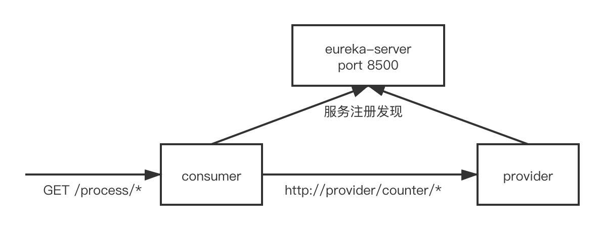

# springcloud-demo

该项目基于springboot+springcloud编码，应用于基于kubernetes平台的一些测试工作，包含三个子项目`eureka-server`、`consumer`、`provider`，且架构如下：

## 构建

### 编译命令

编译命令可以在总项目下运行进行构建，构建完成后会在各个子项目目录下生成`target/`目录；也可以在子项目下分别运行进行构建，构建完成后在运行命令的子项目目录下生成`target/`目录

``mvn clean && mvn -Dmaven.test.skip=true``

### 镜像构建

Dockerfile文件位于各个子项目根目录下（事实上，它们的Dockerfile内容一样），各个子项目构建命令为：

``docker build -f {projectDir}/{subProject}/Dockerfile -t {镜像名}:{标签} {projectDir}/{subProject}``

## 配置

在构建镜像完成后，使用JAVA_OPTS环境变量传递运行参数。

例如使用`-Dspring.config.location={applicationYamlFileUrl}`指定jar包加载外部application.yml配置文件。

## 接口

### consumer

consumer作为对外提供服务的聚合层，提供给浏览器调用，其本身会调用provider服务获取计算好的结果，接口如下：

- GET /process/add 通过consumer调用provider获取两个随机数相加后的结果
- GET /process/multi 通过consumer调用provider获取两个随机数相乘后的结果

### provider

provider作为服务提供者，为consumer提供计算能力，其包含两个接口提供给consumer进行调用，接口如下：

- GET /counter/add 获取两个随机数相加后的结果
- GET /process multi 获取两个随机数相乘后的结果

## 高可用

### eureka-server

服务注册中心可以高可用部署，需要配置application.yml中eureka.client.service-url.defaultZone字段或环境变量eureka.client.serviceUrl.defaultZone为其他eureka地址，例如有两个部署在Kubernetes集群中的实例，且其在Kubernetes的服务名分别为`eureka-server1`、`eureka-server2`，开放端口都为`8500`，那么`eureka-server1`的defaultZone字段就应为`http://eureka-server2:8500/eureka`；`eureka-server2`的defaultZone字段就应为`http://eureka-server1:8500/eureka`

### consumer & provider

consumer和provider服务对于eureka来说都是直接注册的，且不论实例数量，只需要其ip+端口不重复即可，故本身可以启动多个实例

## Kubernetes部署注意事项

### eureka-server

其注册地址，就是在上节中提到过的defaultZone字段需要用环境变量或更改配置文件的方式进行变更，若为单实例则需要配置自身的服务地址（servicename），若为多实例，则需要配置其它eureka的服务地址

同样的，在consumer和provider注册到eureka上时，也需要是用哪个环境变量或更改配置文件的方式变更defaultZone字段，配置所有eureka实例的服务地址，例如环境变量`eureka.client.serviceUrl.defaultZone=http://eureka-server1:8500/eureka/, http://eureka-server2:8500/eureka/`（该环境变量无法在linux系统下直接使用export配置，但是可以通过docker或kubernetes的环境变量配置方式注入到环境变量文件中）